<div align="center">

# 🚀 NexOps Enterprise Platform — AWS Cloud Infrastructure

### Production-style, three-tier AWS infrastructure provisioned entirely with Terraform

Deploys and runs the **Enterprise Employee Management System (EEMS)** — a containerized React + Node.js + PostgreSQL application — on a self-healing, load-balanced, auto-scaling AWS backbone.

[](https://www.terraform.io/)
[](https://aws.amazon.com/)
[](https://www.docker.com/)
[](https://www.postgresql.org/)
[](https://nginx.org/)
[](https://aws.amazon.com/amazon-linux-2023/)
[](https://www.gnu.org/software/bash/)

</div>

---

## 📋 Table of Contents

- [Tech Stack](#-tech-stack)
- [Architecture](#-architecture)
- [Project Structure](#-project-structure)
- [Prerequisites](#-prerequisites)
- [Step-by-Step: Deploy](#-step-by-step-deploy)
- [Verify It's Actually Live](#-verify-its-actually-live)
- [Monitoring & Alerts](#-monitoring--alerts)
- [Tear Down](#-tear-down)
- [Documentation](#-documentation)
- [What This Demonstrates](#-what-this-demonstrates)

---

## 🛠 Tech Stack

| Layer | Technology |
|---|---|
| **Infrastructure as Code** | Terraform (modules, remote state, workspaces-ready) |
| **Compute** | EC2 (Amazon Linux 2023), Auto Scaling Group, Launch Template |
| **Networking** | VPC, public/private subnets across 2 AZs, NAT Gateway, Internet Gateway, Route Tables |
| **Load Balancing** | Application Load Balancer, Target Groups, HTTP→HTTPS redirect, Health Checks |
| **Database** | RDS PostgreSQL, Secrets Manager |
| **Storage** | S3 (encrypted, versioned, private) |
| **Containers** | Docker, Docker Hub |
| **Reverse Proxy** | Nginx |
| **Serverless** | AWS Lambda, EventBridge |
| **Monitoring** | CloudWatch Alarms, SNS (email alerts) |
| **Security** | IAM least-privilege roles, Security Groups, SSM Session Manager (no SSH) |
| **DNS / TLS** | Route 53, ACM DNS validation, HTTPS |\n| **Access Control** | AWS CLI, IAM users/policies |

---

## 🏗 Architecture

See [`diagrams/architecture.md`](diagrams/architecture.md) for the full diagram and network layout breakdown.

**High-level flow:** GoDaddy-registered domain → Route 53 authoritative DNS → ACM TLS certificate → HTTPS Application Load Balancer (public subnets) → Auto Scaling Group of EC2 instances (private app subnets, min 2 for high availability) → Nginx reverse proxy → Docker Hub EEMS images (React frontend + Node.js backend) → RDS PostgreSQL (private DB subnets) + S3 (uploads) + Secrets Manager (credentials). If no custom domain is configured yet, the ALB DNS name remains available for validation.

<p align="center">
  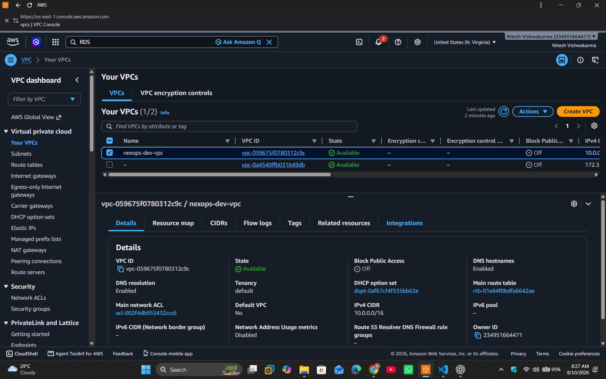
</p>

---

## 📁 Project Structure

<p align="center">
  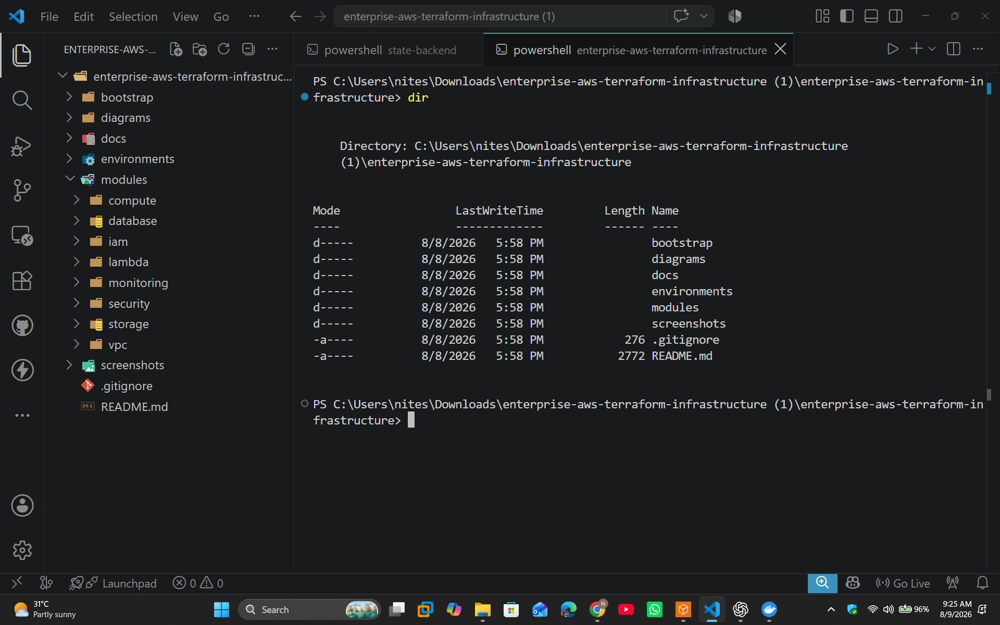
</p>

```
enterprise-aws-terraform-infrastructure/
│
├── bootstrap/state-backend/   # one-time: S3 + DynamoDB for remote Terraform state
├── modules/
│   ├── vpc/            # VPC, subnets, routing, NAT
│   ├── security/         # security groups (ALB / app / db tiers)
│   ├── iam/               # Lambda execution role
│   ├── database/          # RDS PostgreSQL + Secrets Manager
│   ├── storage/           # S3 uploads bucket
│   ├── compute/           # ALB, Launch Template, Auto Scaling Group, EC2 IAM role
│   ├── lambda/             # scheduled housekeeping function
│   └── monitoring/         # SNS + CloudWatch alarms
├── environments/dev/        # root config: wires all modules together
├── diagrams/architecture.md
├── docs/                    # deployment guide, incident postmortem, troubleshooting, interview Q&A
└── screenshots/
```

---

## ✅ Prerequisites

<p align="center">
  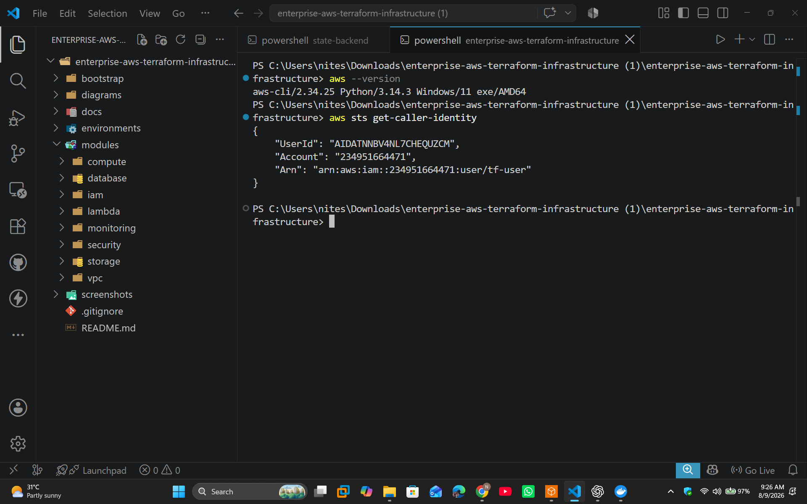
  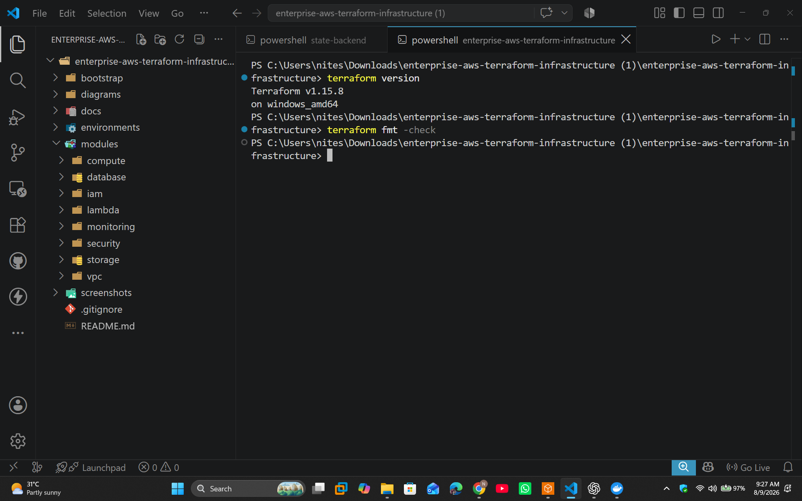
</p>

- **Terraform** ≥ 1.6.0 — verify with `terraform version`
- **AWS CLI v2**, configured with credentials — verify with `aws sts get-caller-identity`
- An **AWS account** (dev/sandbox recommended)
- **Docker Hub account** with the application images already pushed (see below)

<p align="center">
  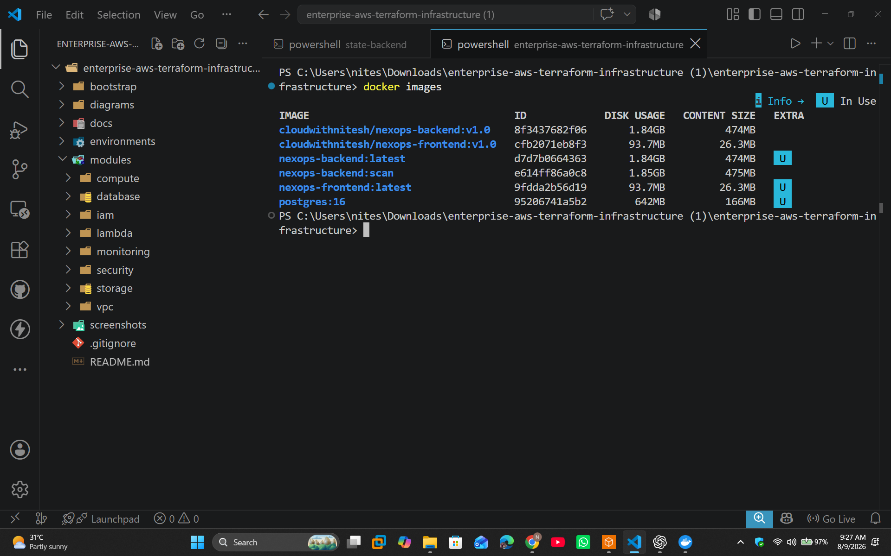
</p>

---

## 🚀 Step-by-Step: Deploy

### 1. Bootstrap the remote state backend *(one-time, per AWS account)*

```bash
cd bootstrap/state-backend
terraform init
```
<p align="center">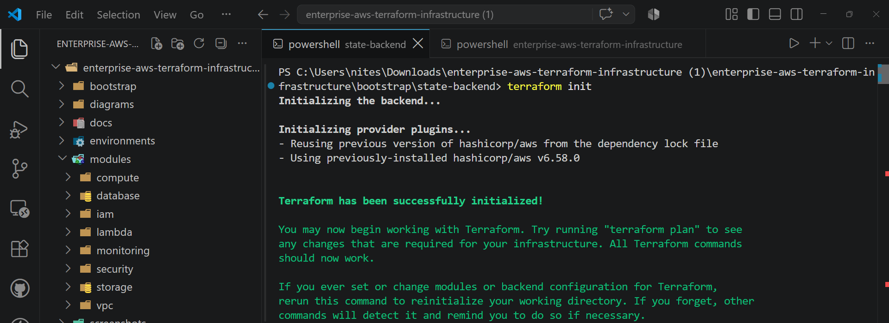</p>

```bash
terraform validate
```
<p align="center">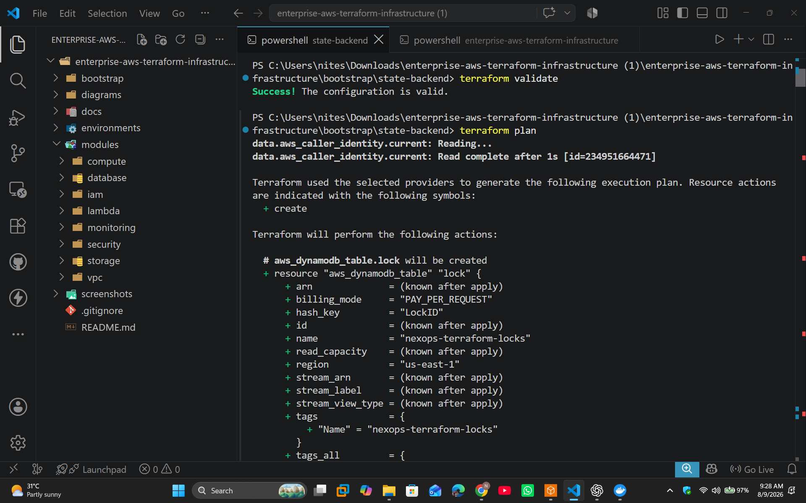</p>

```bash
terraform plan
```
<p align="center">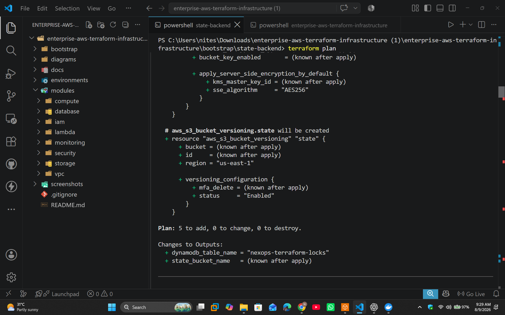</p>

```bash
terraform apply
```
<p align="center">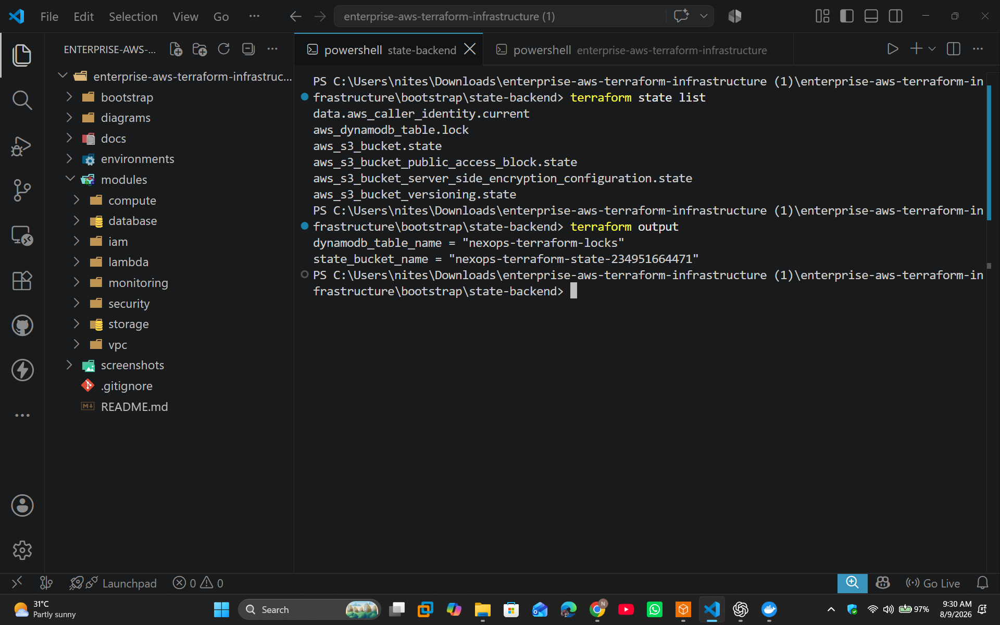</p>

Note the `state_bucket_name` and `dynamodb_table_name` outputs — you need both for the next step.

### 2. Point the environment at that backend

Edit `environments/dev/backend.tf`, replacing the placeholder with your real bucket name:
```hcl
terraform {
  backend "s3" {
    bucket         = "nexops-terraform-state-<YOUR_ACCOUNT_ID>"
    key            = "environments/dev/terraform.tfstate"
    region         = "us-east-1"
    dynamodb_table = "nexops-terraform-locks"
    encrypt        = true
  }
}
```

### 3. Configure your variables

```bash
cd ../../environments/dev
cp terraform.tfvars.example terraform.tfvars
```

Fill in `alert_email`, `db_name`, `db_username`, `backend_image`, and `frontend_image`.

For a GoDaddy-registered domain, for example `nitesh.shop`, set:

```hcl
route53_zone_name = "nitesh.shop"
domain_name       = "nitesh.shop"
```

The Terraform stack will create the Route 53 hosted zone, ACM certificate, DNS validation records, HTTPS listener, HTTP→HTTPS redirect, and ALB alias record.

**GoDaddy delegation is the only manual DNS step.** Because ACM DNS validation needs the Route 53 zone to be authoritative, create the hosted zone first:

```bash
terraform apply -target=module.route53.aws_route53_zone.this[0]
terraform output route53_name_servers
```

Copy the four Route 53 name servers into the GoDaddy domain's **Nameservers** settings and choose the option to use custom nameservers. Do not create a separate application A record in GoDaddy; Route 53 becomes authoritative.

After DNS delegation is active, run the normal deployment:

```bash
terraform apply
```

Terraform will then create the ACM certificate, validate it through Route 53, attach HTTPS to the ALB, and create the ALB alias record.

Finally:

```bash
terraform output application_url
```

If you do not own a domain yet, leave both DNS variables empty and the stack will run through the ALB DNS name over HTTP. You can enable the domain later with a Terraform apply.

### 4. Deploy the main infrastructure

```bash
terraform init
```
<p align="center">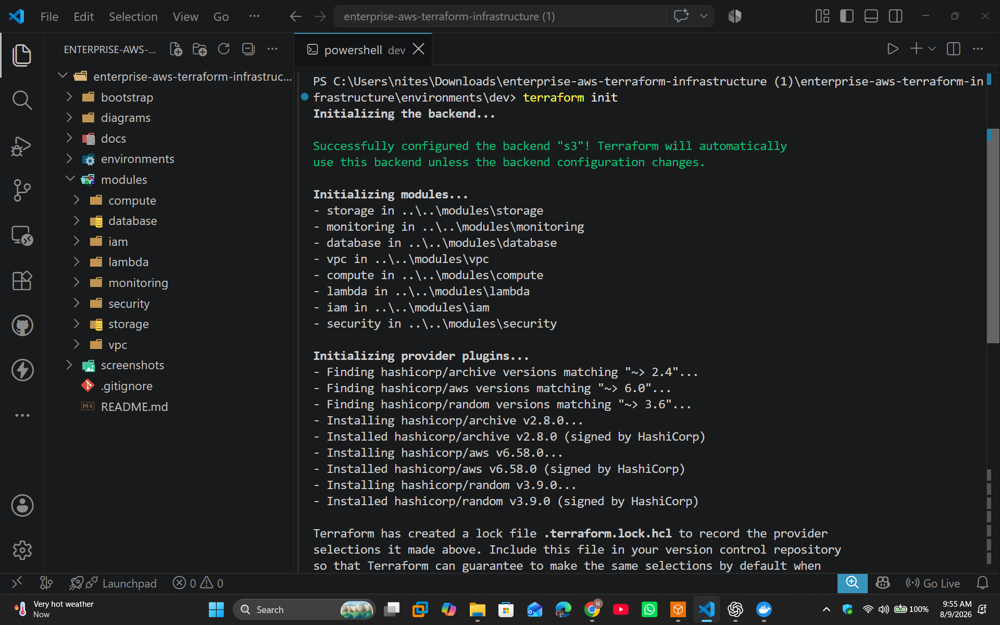</p>

```bash
terraform validate
```
<p align="center">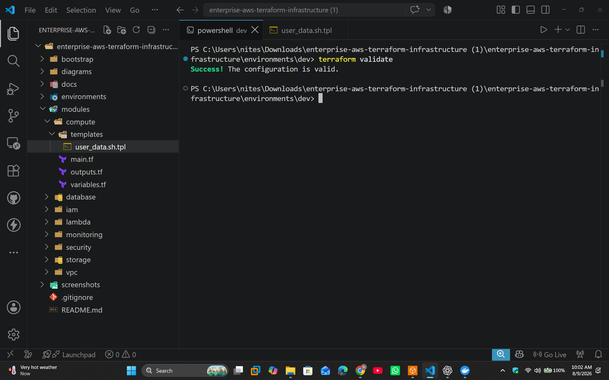</p>

```bash
terraform plan
```
<p align="center">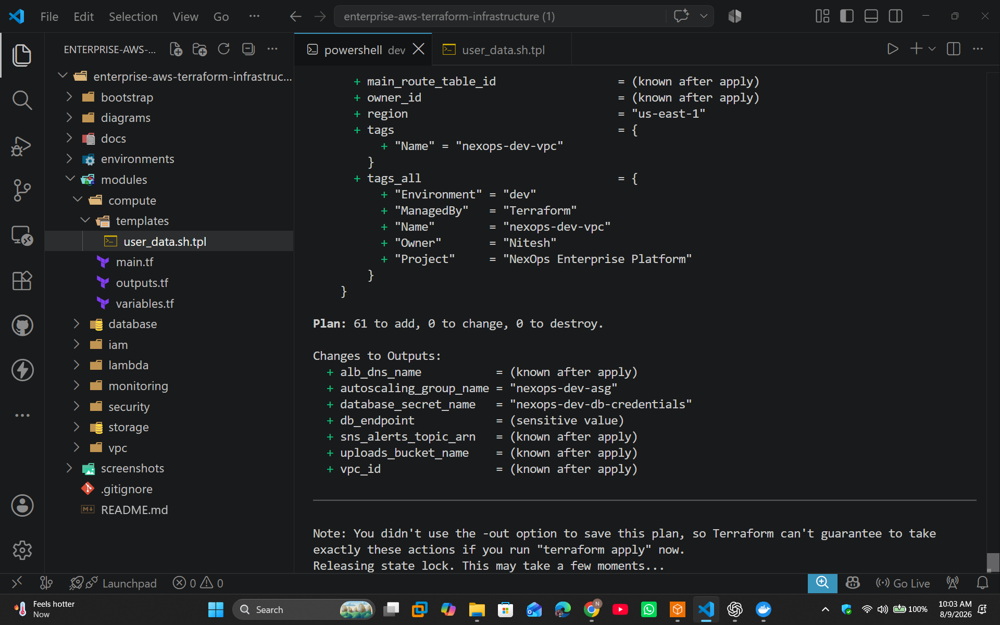</p>

```bash
terraform apply
```
Type `yes` and wait — RDS is the slowest resource (~5 minutes).
<p align="center">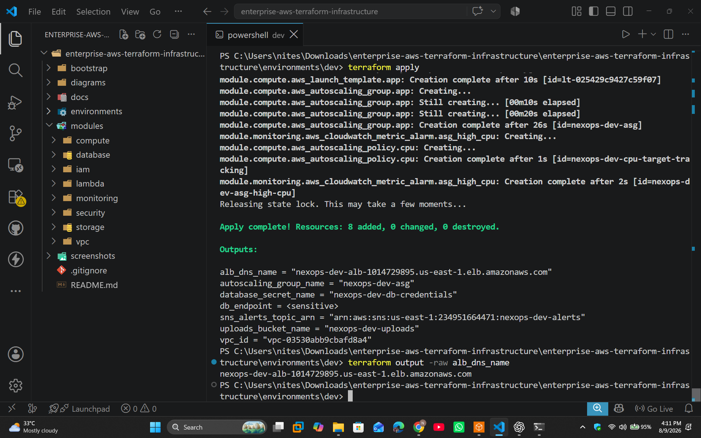</p>

---

## 🌐 Custom Domain and HTTPS

When `domain_name` is set, the deployment uses:

```text
GoDaddy registrar
      │
      │ nameservers delegated to Route 53
      ▼
Route 53 Hosted Zone
      │
      ├── A/ALIAS → ALB
      └── ACM DNS validation
                 │
                 ▼
        ACM TLS Certificate
                 │
                 ▼
       HTTPS ALB :443
                 │
          HTTP :80 redirects
                 │
                 ▼
        Private EC2 ASG
```

The application URL is:

```bash
terraform output application_url
```

For example:

```text
https://nitesh.shop
```

Route 53 and ACM are optional until you purchase the domain; no domain credentials or GoDaddy API tokens are stored in Terraform.

## 🔍 Verify It's Actually Live

**Check the Auto Scaling Group has 2 healthy instances** (not 1 — see [`docs/HOW_ALB_ASG_CLOUDWATCH_WORK.md`](docs/HOW_ALB_ASG_CLOUDWATCH_WORK.md) for why that matters):
<p align="center">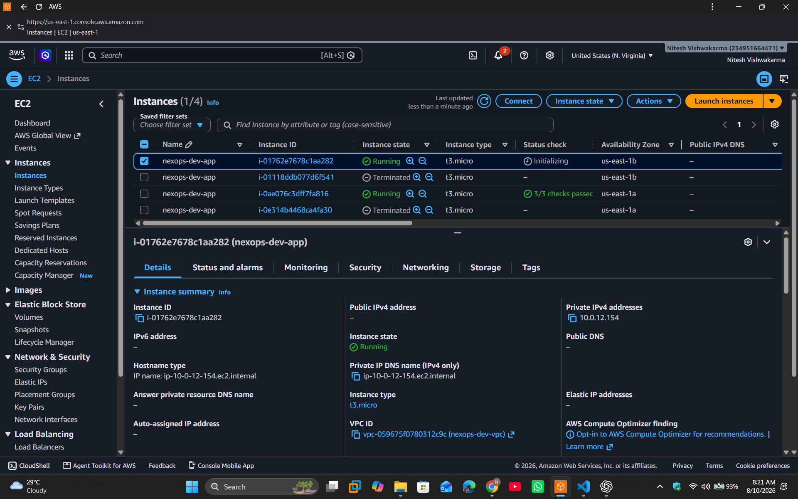</p>

**Check the target group shows both targets healthy:**
<p align="center">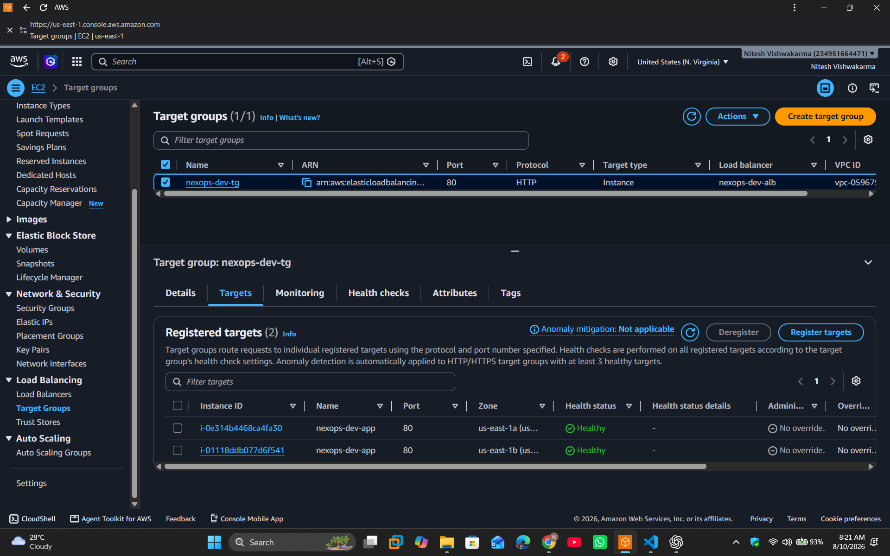</p>

**Check the Load Balancer itself:**
<p align="center">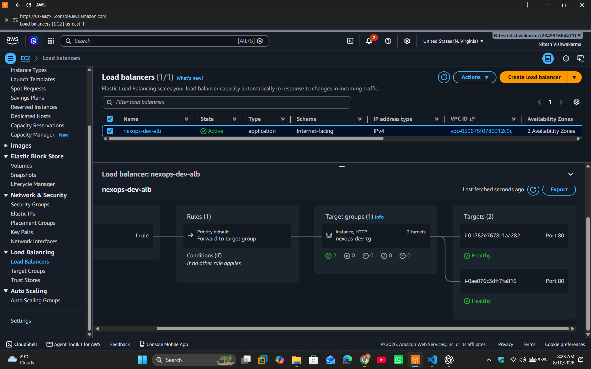</p>

**Check RDS PostgreSQL is running:**
<p align="center">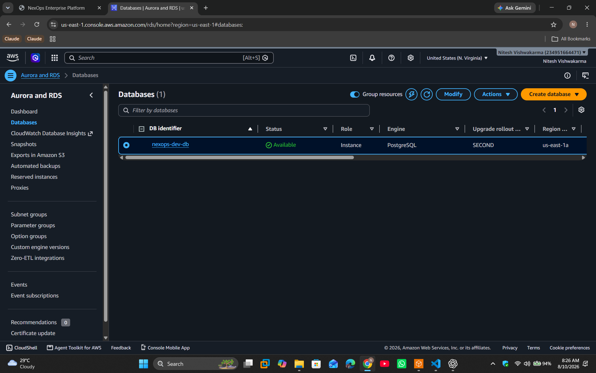</p>

**Get the live URL:**
```bash
terraform output alb_dns_name
```
<p align="center"></p>

**Open it in a browser — the application is live:**
<p align="center">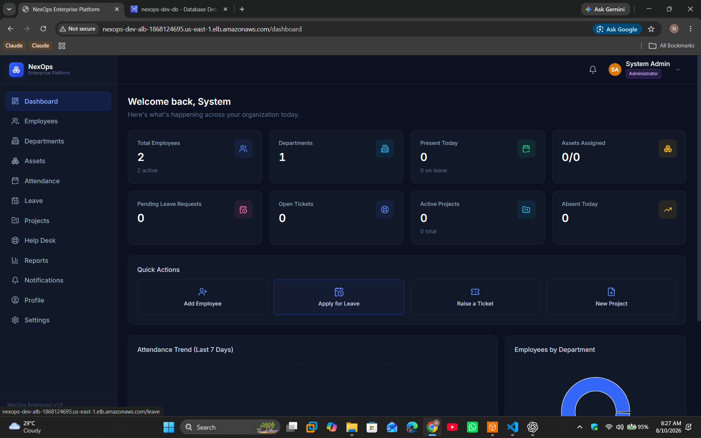</p>

**All provisioned resources at a glance:**
<p align="center">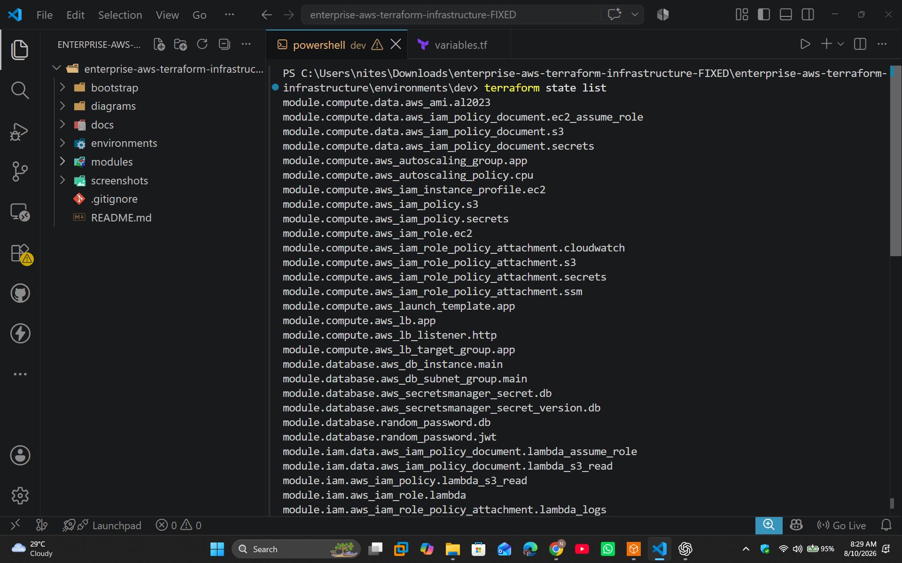</p>

---

## 📈 Monitoring & Alerts

CloudWatch alarms (ASG CPU, ALB 5xx errors, ALB unhealthy hosts, RDS CPU, RDS storage) publish to an SNS topic that emails you on state changes. Confirm the subscription email when it arrives:

<p align="center"></p>

See [`docs/HOW_ALB_ASG_CLOUDWATCH_WORK.md`](docs/HOW_ALB_ASG_CLOUDWATCH_WORK.md) for how the ALB, ASG, and these alarms work together end to end.

---

## 🧹 Tear Down

When you're done — this stack costs real money while running (NAT Gateway + RDS + EC2):

```bash
cd environments/dev
terraform destroy
```
<p align="center"></p>

The state backend (`bootstrap/state-backend`) is left in place intentionally (`prevent_destroy` on the state bucket) — destroy it manually and separately only if fully decommissioning the account.

---

## 📚 Documentation

| Doc | What it covers |
|---|---|
| [`docs/DEPLOYMENT_GUIDE.md`](docs/DEPLOYMENT_GUIDE.md) | Full deploy/teardown steps |
| [`docs/INCIDENT_POSTMORTEM.md`](docs/INCIDENT_POSTMORTEM.md) | Every real bug hit on first deploy — root causes and exact fixes |
| [`docs/HOW_ALB_ASG_CLOUDWATCH_WORK.md`](docs/HOW_ALB_ASG_CLOUDWATCH_WORK.md) | How the ALB, ASG, and CloudWatch alarms actually work together |
| [`docs/TROUBLESHOOTING.md`](docs/TROUBLESHOOTING.md) | Common failure modes |
| [`docs/INTERVIEW_QA.md`](docs/INTERVIEW_QA.md) | Talking points for explaining this design |
| [`diagrams/architecture.md`](diagrams/architecture.md) | Architecture diagram + network layout |

---

## 💡 What This Demonstrates

- Infrastructure as Code with modular, reusable Terraform (VPC, security, IAM, database, storage, compute, Lambda, monitoring as independent modules)
- Remote state management with S3 + DynamoDB locking, bootstrapped separately from the main stack
- High availability: multi-AZ Auto Scaling Group behind an Application Load Balancer, zero-downtime rolling deploys via instance refresh
- Least-privilege IAM, no SSH (SSM Session Manager only), private subnets for app + database tiers
- Secrets management via AWS Secrets Manager — no credentials hardcoded or baked into images
- Proactive monitoring: CloudWatch alarms → SNS → email, before a user ever reports a problem
- Real incident response — see [`docs/INCIDENT_POSTMORTEM.md`](docs/INCIDENT_POSTMORTEM.md) for genuine bugs hit and fixed during first deployment, not a sanitized success story

---

<div align="center">

Built by **Nitesh** as part of a multi-project cloud/DevOps portfolio.

</div>
